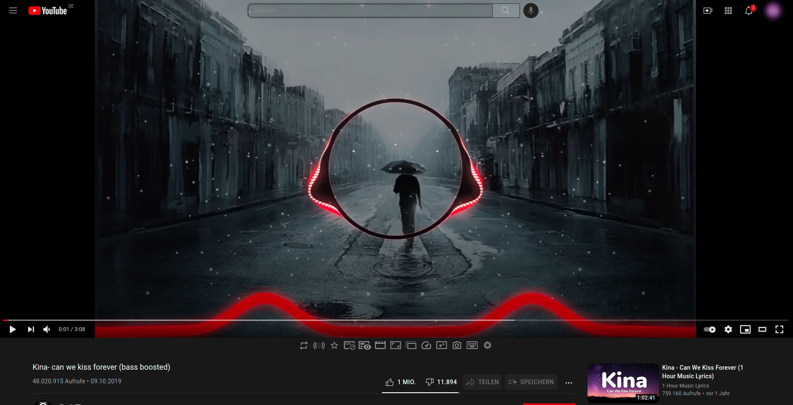

# TinoTube
Css overwrite for youtube

# What this is
css rules for youtube style

# how to install
simplest way is to get an extension that lets you use costum css, for example [Stylebot](https://chrome.google.com/webstore/detail/stylebot/oiaejidbmkiecgbjeifoejpgmdaleoha)

# Please
 - Give feedback
 - tell me ideas
 - use the issues tab

